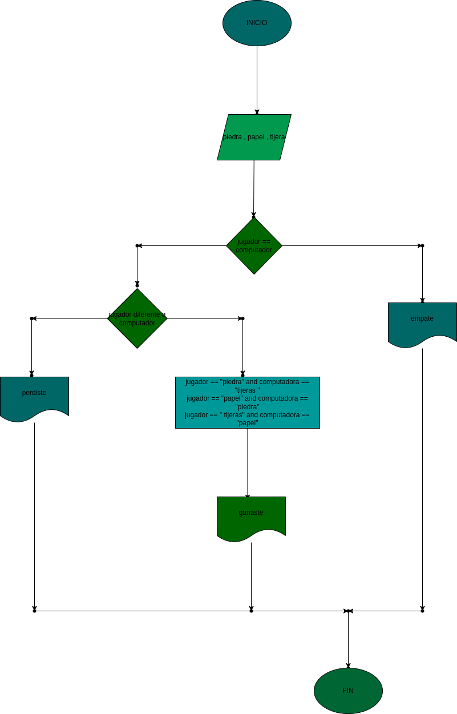

# piedra_papel_tijera
juego contra el computador sobre piedra, papel o tijera

# ANALISIS
ENTRADA
- piedra
- papel
- tijera

PROCESO
- jugador escoje igual a el compuatdor
- jugador piedra y computador tijera; jugador tijera y computador papel; jugador papel y computadora piedra
- jugador piedra y computador papel; jugador tijera y computador piedra; jugador papel y computador tijera

SALIDA
- empate
- ganaste 
- perdiste 

# DISEÑO

